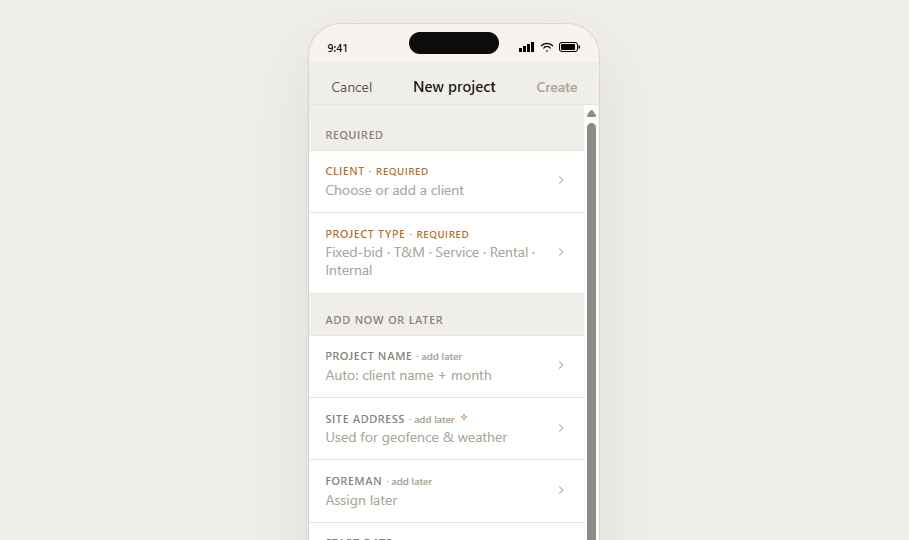

# Estimator Persona

The bulk of the system. The estimator is the owner / PM / sales lead — usually the same person at companies under ~$10M revenue. They live in the desktop app primarily and use the mobile app on the road.

This README documents the desktop product. Mobile estimator screens are documented in `mobile-screens.md` (sibling file).

## Who they are

The person who makes the money decisions. They:
- Walk a job site with a client, sketch scope on a tablet
- Build the estimate in the office that night
- Send it, follow up, win it (or lose it)
- Hand the won project to a foreman
- Track budget burn vs actuals daily
- Bill the client at milestones
- Reconcile with QuickBooks weekly
- Manage their rental yard inventory and the small fleet of trucks

They are **not** a back-office person. Most of them ran a hammer for 20 years before they ran a business. Sitelayer's job is to make the financial layer feel as native as the field layer.

## Form factor

**Desktop primary**, mobile secondary. The desktop is `index.html`; mobile companion is `Mobile.html` (PWA).

## Top-level navigation

Left sidebar (collapsible). Top sections:

| Section | Purpose |
|---|---|
| **Home** | Dashboard — today's projects, overnight changes, AI priority cards, alerts |
| **Projects** | The list of all projects in any state (drafting → archived). The biggest section. |
| **Schedule** | 4-week look-ahead crew + asset planner |
| **Time** | Approval queue + labor cost rollup |
| **Rentals** | The yard — catalog, dispatch, returns, utilization, customer portal |
| **Reports** | Bid accuracy, win rate, labor margin |
| **Settings** | Integrations, pricing, company, profile |

---

## Project state model

Every project moves through these states; the UI presents differently for each.

```
   draft  ─►  estimating  ─►  sent  ─►  accepted  ─►  in-progress  ─►  done  ─►  archived
                                  │            │
                                  ▼            ▼
                              declined     change-order
                                            (sub-state)
```

| State | Where it lives | Key UI |
|---|---|---|
| draft | Projects > All | Quick chip; minimal data |
| estimating | Projects > Estimating | Takeoff + estimate builder live here |
| sent | Projects > Awaiting | Tracks open rate + read receipts |
| accepted | Projects > Active | Schedule slot, foreman assignment |
| in-progress | Projects > Active | Daily logs from foremen, time, materials |
| done | Projects > Closing | Final invoice, retention release |
| archived | Projects > Archive | Read-only; reports source |

---

## Flows

### Flow 1 — Cold project to sent estimate

```
  Home  →  + New project
              │
              ▼
        prj-create-sheet  ← Client + Archetype required; AI suggests budget + scope based on archetype + zip
              │
              ▼
        prj-detail (state: draft) — shell with progressive prompts
              │  taps "Start takeoff"
              ▼
        takeoff-canvas  ← drawing import; agent-drafted polygons; manual adjust
              │  taps "Build estimate"
              ▼
        estimate-builder  ← line items from takeoff; pricebook; AI bid-accuracy keystone in right rail
              │  taps "Send"
              ▼
        send-sheet  ← preview, recipient, message; signed link
              │
              ▼
        prj-detail (state: sent) — open rate / read receipts shown
```

### Flow 2 — Won → in-progress → invoice

```
  prj-detail (sent)  →  Client signs portal link
                              │
                              ▼
                        prj-detail (accepted) — Foreman assignment prompt
                              │  PM picks foreman + start date
                              ▼
                        prj-detail (in-progress) — daily logs roll in from foreman
                              │
                              │  every day: time, materials, photos accumulate
                              ▼
                        prj-detail Budget tab — live vs budget; AI flags drift
                              │  hits 50% milestone
                              ▼
                        invoice-create  ← AIA-style schedule of values; auto-fills from logged scope
```

### Flow 3 — Rental dispatch from inside a project

```
  prj-detail (in-progress)  →  Materials tab  →  + Add equipment
                                                   │
                                                   ▼
                                          rentals-yard-quickadd  ← scoped to project; inventory aware
                                                   │  picks 2 mixers + 1 generator
                                                   ▼
                                          rentals-dispatch-confirm  ← when, who's picking up, billing toggle
                                                   ▼
                                          back to prj-detail; equipment chips on Materials tab
```

---

## Screens — desktop

### `home-dashboard` — Calm dashboard


The first screen on login. **Calm by default** — when nothing's wrong, it doesn't manufacture urgency.

**Layout:**
1. Greeting + date + weather strip (top)
2. **AI priority row** — up to 3 cards across, only when warranted: an estimate awaiting follow-up, a project drifting, an invoice past due. If nothing qualifies, this row collapses.
3. **KPI strip** — `Live work` (in-progress dollars), `In-flight estimates` (sent count), `Idle revenue` (rental yard idle dollars), `This week labor cost`
4. **Today's projects** — stacked cards showing in-progress + foreman + crew count + today's status pulled from foreman daily logs
5. **Quick actions** — `New project`, `New estimate`, `Quick invoice`

The AI priority row uses `MAiStripe` desktop variants. Confidence is ordinal — see AI rules.

### `projects-list` — Projects index


Big sortable table with persistent filters in the left rail. Columns: Project · Client · State · Value · Foreman · Start · % complete · Margin pill.

State-filter pills at top: All · Estimating · Awaiting · Active · Closing · Archive.

Row click → `prj-detail`. Bulk select → archive / export / reassign foreman.

### `prj-detail` — Project detail (multi-tab)


The most-used screen in the system. Sub-nav (top): **Overview · Estimate · Schedule · Crew · Materials · Budget · Log · Files**.

- **Overview** — sentence-summary header (e.g. "Hillcrest Mews, $214,800 EPS-and-stucco job for Drewski's, on day 18 of 32"); action rows (Send change order · Invoice milestone · Brief crew); recent activity stream
- **Estimate** — line items grouped by scope; bid-accuracy keystone in right rail showing this estimate's predicted variance vs historical
- **Schedule** — slot in the 4-week planner
- **Crew** — assigned workers + foreman + per-day hours grid
- **Materials** — pricebook items + rental dispatches scoped to project
- **Budget** — live vs budget table; AI drift flag stripe at top when variance exceeds threshold
- **Log** — daily logs from foreman (`fm-log` outputs land here)
- **Files** — drawings, contracts, signed estimates, photos

### `prj-create-sheet` — New project sheet


Single-step modal sheet, not a multi-page wizard. Required: **Client** (with QuickBooks dedupe inline) + **Archetype** (EPS, framing, stucco, etc.). Everything else is progressive — type more, more fields appear.

AI sub-card: "Based on 7 closed jobs in 90210 zip · this archetype averages $48k–$72k. Budget suggestion: $58k." Accept → carries into estimate builder as a target.

### `takeoff-canvas` — Takeoff


Drawing canvas. Drop a PDF; agent drafts polygons for likely scope; PM adjusts. Right rail shows running quantities by category. Bottom strip: scale calibration + measurement tools.

### `estimate-builder` — Estimate builder


Three-pane layout: scope tree (left) · line items table (center) · keystone right rail.

- Right rail's primary card: **Bid accuracy keystone** — predicted margin + historical comparable jobs + spark confidence + dismiss
- Density-aware: collapses to a single chip when estimate is small (<10 lines)
- All numbers tabular

### `schedule-ahead` — 4-week schedule


Horizontal timeline. Rows = crews/foremen. Columns = days. Project bars span days. Drag to reschedule. AI suggests takeoff-day slots based on historical scope-to-takeoff lag time.

### `time-queue` — Time approval queue


The estimator's view of all foremen-approved hours, ready for payroll. Single tab (no sub-tabs — the foreman is the approver, this is just final confirm + payroll handoff). AI flags anomalies (e.g., overlap between two sites, missing meal break) as inline chips on rows. Bulk approve → payroll.

### `rentals-home` — Rental yard home


Hero KPI: **Idle revenue** — dollars/day the yard is currently leaving on the table. AI suggestion stripe: "Mixer 8 has been idle 11 days. Two active projects could use it." with deep link.

### `rentals-catalog` — Catalog


Inventory grid. Each item: photo, name, category, status (Out / In + damage flags), days idle, lifetime utilization %. Negative-balance reconciliation indicator on rows where physical count drifted from system.

### `rentals-dispatch` — Dispatch


Send equipment to a job. Picks: project (dedupe with active list) · equipment · driver · when · billing toggle (bill upfront vs at return).

### `rentals-returns` — Returns


Check-in flow. Each return row has a damage flag option — checking it spawns a repair work order linked to the original dispatch.

### `rentals-utilization` — Utilization


Per-asset chart of in/out cycles + idle days. **Monetize panel:** AI lists items with high idle %, suggests vehicle for monetization (sell, off-load to other yards, list on customer portal).

### `rentals-portal` — Customer portal


External-facing (different domain). Customers browse the catalog, schedule, confirm. Designed to look distinct from the operator app — lighter, more retail. See `Portal.html`.

### `invoice-create` — Invoice


AIA-style schedule of values. Auto-fills line items from completed scope. Net-30 default. Sends via email or signed portal link.

### `settings-integrations` — Integrations


QuickBooks, Drewski's (or generic supplier), email provider, payment processor. Each integration tile shows last-synced timestamp + reconnect link if auth lapsed.

---

## Mobile estimator screens

The mobile companion mirrors a subset of desktop capability — see `mobile-screens.md` for full detail. The 12 most-used mobile estimator screens:

| Screen | Purpose |
|---|---|
| `mb-home` | Dashboard mirror; calm by default |
| `mb-projects` | Filtered project list |
| `mb-prj-detail` | Project sub-nav with same tabs as desktop |
| `mb-takeoff` | Photo-driven mobile takeoff |
| `mb-estimate` | Line items review + send |
| `mb-schedule-day` | Today's site schedule |
| `mb-time-queue` | Approval queue (mobile review while traveling) |
| `mb-rentals-catalog` | Yard inventory (used at the yard) |
| `mb-rentals-dispatch` | Dispatch from phone |
| `mb-invoice-quick` | Quick invoice create |
| `mb-settings` | Profile + notifications |
| `mb-pwa-install` | PWA install prompt + permission primes |

---

## State the estimator app reads

| Data | Source |
|---|---|
| Daily logs | Foreman's `fm-log` output |
| Approved hours | Foreman's `fm-time-review` output |
| Field events | (Read-only) for project context |
| Crew assignments | Schedule + foreman briefs |
| Rental status | Yard system |

## State the estimator app writes (that affects other personas)

| Action | Affects |
|---|---|
| Create project + assign foreman | Foreman sees in `fm-today` next morning |
| Commit estimate-of-record | Foreman + worker see scope in their morning brief |
| Schedule a project | Foreman sees on their week ahead |
| Dispatch equipment | Foreman sees expected delivery on `fm-today` |

---

## Non-goals (do NOT add)

- HR / payroll inside the app (handoff to QB Payroll)
- CRM / lead management beyond the project list
- Marketing / website builder
- Native iOS or Android apps (PWA only)
- Offline-first desktop (mobile is offline-capable; desktop assumes connection)
- A separate "Owner" persona — owner *is* estimator at this market segment
