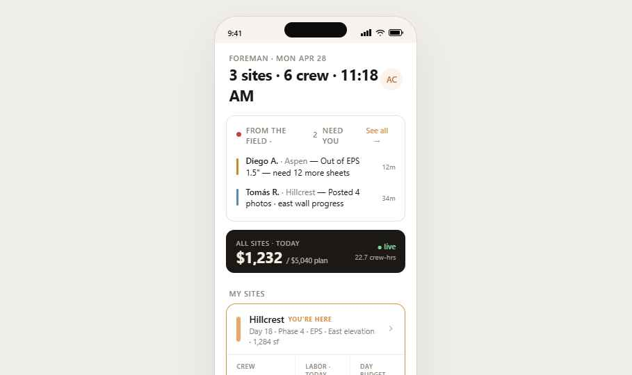
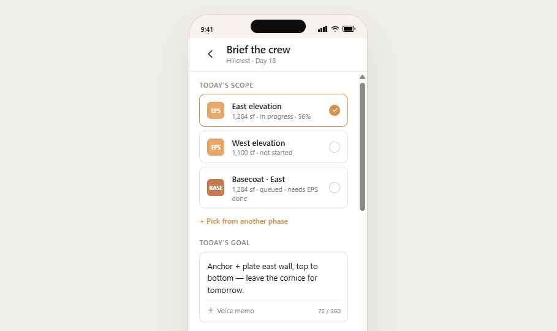
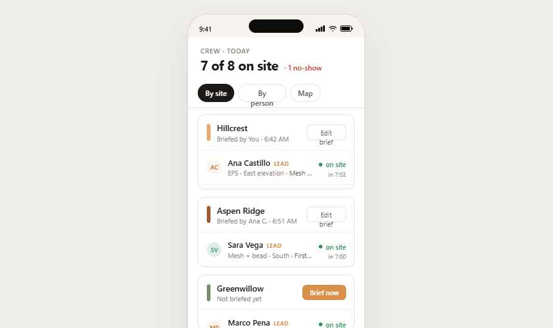
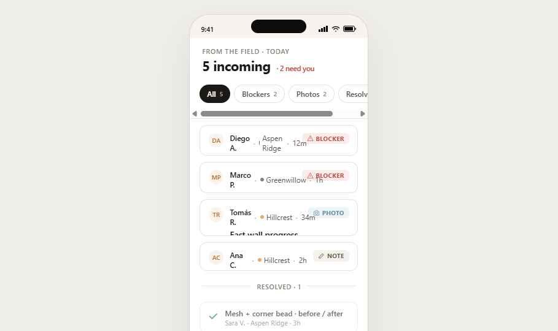
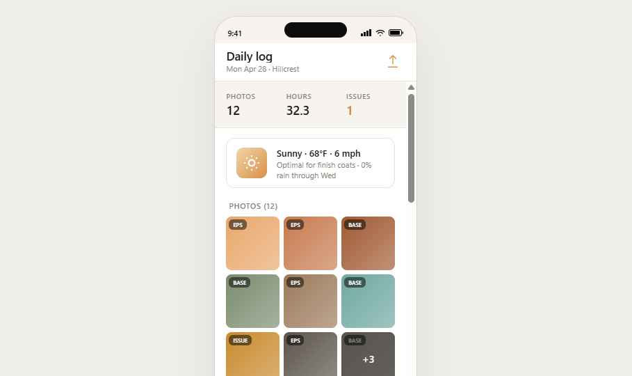

# Foreman Persona

## Who they are

The site lead. Runs one or more crews across one or more sites. Often a working foreman — they're swinging a hammer for half the day and managing the other half. They use the app:
- 6:30 AM in the truck — review today, brief the crew, send the morning push
- Throughout the day — handle field events (blockers, photos, hours corrections) as they come in
- 4:00 PM — approve hours, write the daily log, sign off
- Mid-week — check budgets and burn rates on their projects

Foremen are the **decision filter** between the crew and the office. The estimator/owner doesn't see worker pings directly — the foreman triages first. Most issues are resolved at this layer.

## Form factor

**Mobile primary**, but foremen often have a tablet in the truck. Light theme by default — they're commonly indoors at the start/end of the day, and the lighter UI distinguishes their app from the worker's dark UI when both are nearby on a job. Glove-friendly tap targets but slightly denser than worker (more info per screen — they're triaging, not just looking).

## Tab structure

Five tabs:

| Tab | Icon | Purpose |
|---|---|---|
| Today | `home` | Multi-site stacked home — every active project, today's status |
| Crew | `users` | Live roster with clock states, hours-this-week per person |
| Field | `alert` | Inbox of field events (blockers, questions, photos) needing triage |
| Log | `doc` | Daily-log builder — gets sent to the office at end of day |
| Time | `time` | Hours review + approval for the foreman's crew |

---

## Flows

### Flow 1 — The morning brief (6:30 AM)

```
[Foreman opens app from truck]
        │
        ▼
  fm-today           ← stacked cards for today's sites; weather; AI stripe with overnight changes
        │  taps "Brief the crew" on Hillcrest card
        ▼
  fm-brief           ← scope builder pre-filled from yesterday's plan + AI draft
        │  edits goal, confirms steps, adds a note
        │  taps Send
        ▼
  back to fm-today   ← "Briefed Hillcrest crew · 7 will see it" toast

  ↳ Workers see this in wk-today + wk-scope within seconds
```

### Flow 2 — Triage a field event

```
  fm-today (notification dot on Field tab)
        │
        ▼
  fm-field           ← list of pings: "Marcus: Material short — 8 sheets EPS"
        │  taps the row
        ▼
  fm-blocker-detail  ← context: who, when, where, photo, voice note
        │  picks resolution: "Order more" → triggers rental-yard order
        │             OR    "I'll bring it" → assigns to self
        │             OR    "Use what's on truck 4" → posts back to worker
        ▼
  back to fm-field   ← row marked resolved with Foreman's chosen action
```

### Flow 3 — End-of-day signoff (4:00 PM)

```
  fm-today  →  Time tab  →  fm-time-review
                                │  reviews each worker's day; bumps Marcus's clock-out by 12 min
                                │  approves all
                                ▼
                  Log tab  →  fm-log (daily-log builder)
                                │  AI has assembled photos by scope step + auto-summary
                                │  foreman edits the summary, adds material usage
                                │  taps Send to office
                                ▼
                  Estimator receives a Daily Log entry on prj-detail
```

---

## Screens

### `fm-today` — Today (stacked sites)



**Purpose:** Single-glance view of every site this foreman is responsible for today. Replaces "checking in with each project's status" with a stacked card pattern.

**Layout:**
1. LargeHead: `Today` + sub `Mon · Apr 28 · 6:42 AM`
2. **Weather strip** — small inline card with temp + condition + wind. Used to flag wet/cold days that affect scope (e.g., concrete pour).
3. **AI stripe** (`MAiStripe`, accent left border):
   - Eyebrow `OVERNIGHT`
   - Title: e.g., `Drewski's order arrived. Hillcrest is unblocked.`
   - Body: 2-3 lines summarizing what changed since the foreman was last in the app
   - Attribution: `Based on overnight events.` + dismiss
4. **Site cards** — one per active site, stacked with 12px gap:
   - Each card has:
     - Project name (17px 600) + site address line (12px ink-3)
     - Status row: clock-in count (`5 of 7 expected`), live progress vs plan (`56%`)
     - **Today's plan** preview (2 lines max, foreman can expand)
     - Two action buttons: `Brief crew` (primary) + `View site` (ghost)
   - Cards reorder by **status priority** — sites with unbriefed crew or unresolved blockers float to the top
5. **Bottom tab bar** — Today active

**Interactions:**
- Tap site card body → goes to that project's detail (estimator-style `prj-detail` but in foreman context — different actions)
- `Brief crew` → `fm-brief` for that site
- AI stripe action button (when applicable) → contextual deep link

**Empty state:** "No active sites today. You're off rotation." (no fake content)

---

### `fm-brief` — Brief the crew



**Purpose:** The morning push that becomes every worker's `wk-today` job card and `wk-scope` content.

**Layout:**
1. TopBar: `← Brief crew · Hillcrest`
2. **Today's goal** — large textarea (96px), placeholder: `What's the crew building today, in plain words?`
   - Pre-filled with AI draft from yesterday's leftover scope + the plan; foreman edits
3. **Steps** section — vertical step list:
   - Each step is a row with: order handle (drag), step name, est. duration, materials chip (e.g., "24 sheets EPS"), notes button
   - `+ Add step` row at the end
   - **AI suggestion stripe** beneath the list when relevant: e.g., `Yesterday's "Plate fasteners" wasn't completed — I added it as Step 1.`
4. **Crew assignment** card:
   - Avatars of expected workers + role
   - "Add" / "Remove" controls
   - Note for any specific assignments ("Marcus on cornice")
5. **Materials & deliveries** — list of things expected today (rentals, deliveries from Drewski's)
6. **Send to crew** button — full-width primary

**Send behavior:**
- Workers' `wk-today` cards update instantly via push
- Each worker sees a small "New brief" pip on their app icon
- The brief is recorded as the day's plan-of-record (used later by `fm-log` to compare actual vs planned)

**AI behaviors here:**
- Draft today's goal from yesterday's progress
- Carry over uncompleted steps as Step 1
- Flag if scope mismatches what was sold (estimate-of-record disagreement)
- Suggest crew assignments based on past performance per scope step

---

### `fm-crew` — Live crew



**Purpose:** "Who's where, what state, how many hours this week."

**Layout:**
1. TopBar: `Crew` + `+ Add` action (right)
2. **Stat strip** (3 KPIs):
   - `On site` `5`
   - `On break` `2`
   - `Off-clock` `1`
3. **Filter chips:** All · Hillcrest · Beale Yard · Off-clock today
4. **Crew rows** (inset list):
   - Avatar (with status dot — green clocked-in, amber on break, gray off-clock)
   - Name + role
   - Supporting: current site + today's hours (e.g., `Hillcrest · 4:24 today`)
   - Trailing: this-week hours pill (e.g., `32:18 / 40`)
   - Tap row → opens person sheet (clock history, hours, current location, message)

**Interactions:**
- Long-press row → quick actions: Message · Adjust hours · Reassign site
- The "Adjust hours" action opens `prj-crew-foreman` (the timesheet correction screen) for that worker, that day

**Critical:** This is **not** a HR screen. No PII like SSN or address. Just operational status.

---

### `fm-field` — Field events inbox



**Purpose:** The receiver for everything workers send. The single most important screen for the foreman during work hours.

**Layout:**
1. TopBar: `Field` + filter funnel icon
2. **Severity filter chips:** All · Stopped · Slowing · Question · Resolved
3. **Event rows:**
   - Each row: severity color stripe (4px left edge: red=stopped, amber=slowing, blue=question, green=resolved)
   - Worker avatar + name
   - Headline: the issue category + first line ("Material short — 8 sheets EPS")
   - Supporting: site · timestamp · "2 photos · 14s voice"
   - Trailing: time elapsed since posted (`12m`) + state pill (`Open` / `Resolved`)
4. **AI summary stripe** (top of unresolved cluster): when 3+ events are pinged in <30 min, AI summarizes: `Hillcrest is stuck waiting on EPS sheets. 3 workers are idle.` with a `Resolve all` quick action
5. **Empty state:** `No open events. Nice quiet day.`

**Interactions:**
- Tap row → `fm-blocker-detail`
- Swipe right on row → quick "Acknowledge" (worker sees "Ana saw it" without a full resolution)
- Mark all resolved → batch action

---

### `fm-blocker-detail` — Resolve a blocker


**Purpose:** The detail sheet for one field event. Foreman reads context and picks a resolution.

**Layout:**
1. TopBar: `← Material short · Marcus`
2. **Context card:**
   - Worker avatar + name + role + when (`12m ago`)
   - Site + scope step at time of post
   - Issue text (the message the worker typed)
   - Voice playback strip (waveform + play/pause + 0:14 duration)
   - Photo grid (tap to fullscreen)
   - GPS pin (small static map)
3. **Resolution picker** — segmented options:
   - **Order more** — opens `rentals-yard-add` flow with EPS sheet pre-filled, supplier inferred from project's preferred vendor (Drewski's)
   - **Bring from another site** — opens crew picker + truck inventory
   - **Use what's on hand** — sends a worker-facing message
   - **Park for now** — marks low priority, foreman handles later
4. **Reply box** — what the worker hears: text or canned phrase ("On its way · 30m")
5. **Send & resolve** primary button

**After resolve:**
- Worker's app shows the resolution as a banner on their `wk-today`
- Event row in `fm-field` moves to Resolved with foreman's avatar + action

---

### `fm-log` — Daily log builder



**Purpose:** End-of-day report sent to the office. The foreman doesn't write this from scratch — AI assembles it from the day's events, photos, and time entries; the foreman curates and signs off.

**Layout:**
1. TopBar: `← Daily log · Hillcrest · Apr 28`
2. **AI-assembled summary** (`MAiStripe`, accent border):
   - Eyebrow `DRAFT SUMMARY · BASED ON 47 EVENTS TODAY`
   - 4-6 line paragraph: weather, hours-on-site, scope progress, blockers and how they were resolved, materials used, notes from photos
   - "Edit" link → opens inline editor; foreman tweaks the prose
3. **Photo timeline** — horizontal scroll of today's photos grouped by scope step (each step is a labeled section header; photos auto-tagged by `wk-log`)
4. **Material usage** card:
   - Pre-filled from rental-yard checkouts + deliveries (Drewski's order)
   - Inline editable rows: `EPS 2" sheets · 24 used`
5. **Hours summary** card:
   - Crew · total hours · approved/pending counts
   - Tap → goes to `fm-time-review`
6. **Issues today** — collapsed list of resolved field events
7. **Send to office** primary button — sends to estimator's project record

**What gets sent:** A `DailyLog` record attached to the project that the estimator sees on `prj-detail` under the Log tab.

---

### `fm-time-review` — Approve hours


**Purpose:** End-of-day approval of every worker's hours for the foreman's crew. Foreman is the **only** approver — once they sign off, hours flow to payroll the next morning.

**Layout:**
1. TopBar: `← Time · Apr 28`
2. **Stat strip:**
   - `Crew-hrs` `52:14`
   - `Labor cost` `$2,148` (tabular, ink-3 — informational, not editable)
   - `Pending` `7`
3. **Worker rows** — each row is one person's day:
   - Avatar + name + role
   - Hours: `7:18` (tabular)
   - Site + scope chip
   - Tap → expands inline:
     - Clock-in / clock-out times (editable inline)
     - Break period
     - "Auto-detected" badge if it came from geofence
     - Notes from worker (if any)
     - Approve · Adjust · Reject buttons
4. **AI flag stripe** when relevant: `Marcus's clock-out was 4:48. He posted a photo at 5:02 from the same site. Adjust to 5:02?` with one-tap accept
5. **Approve all** primary button (full width)

**Approval semantics:**
- Approved → flows to payroll the next morning
- Rejected → goes back to worker as a dispute (worker sees in `wk-hours` with red dot)
- Adjusted → recorded as foreman edit; original auto-detect kept in audit trail

---

## State the foreman app reads

| Data | Source | Update cadence |
|---|---|---|
| Today's projects | Project schedule | Each morning |
| Worker clock states | Time service | Realtime push |
| Field events | Workers' `wk-issue` + `wk-log` posts | Realtime push |
| Photos | Workers' camera uploads | Realtime |
| Estimate-of-record | Estimator's project | On commit |
| Material orders | Yard / supplier integrations | When estimator/foreman commits |

## State the foreman app writes

| Action | Endpoint | Affected personas |
|---|---|---|
| Send brief | `POST /briefs` | Workers see in `wk-today` |
| Resolve blocker | `PATCH /field-events/:id` | Originating worker sees resolution |
| Adjust hours | `PATCH /time-entries/:id` | Worker sees adjustment in `wk-hours` |
| Approve hours | `POST /time-entries/approve-batch` | Goes to payroll; estimator sees in budget |
| Submit daily log | `POST /daily-logs` | Estimator sees on `prj-detail` |

---

## Non-goals (do NOT build for the foreman)

- Sending estimates / proposals / change orders to clients
- Project creation (estimator creates; foreman is assigned)
- Invoicing
- AR / payment tracking
- Long-term schedule planning beyond their own crew this week
- Reports & analytics dashboards (those are estimator-side)

If asked to add any of these, the answer is: that belongs to the estimator. Foremen are operational, not financial.
