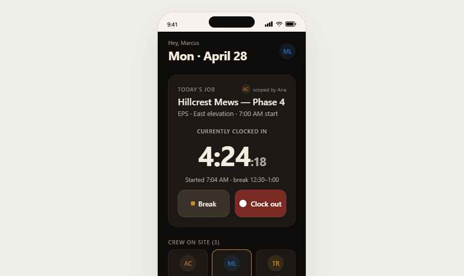
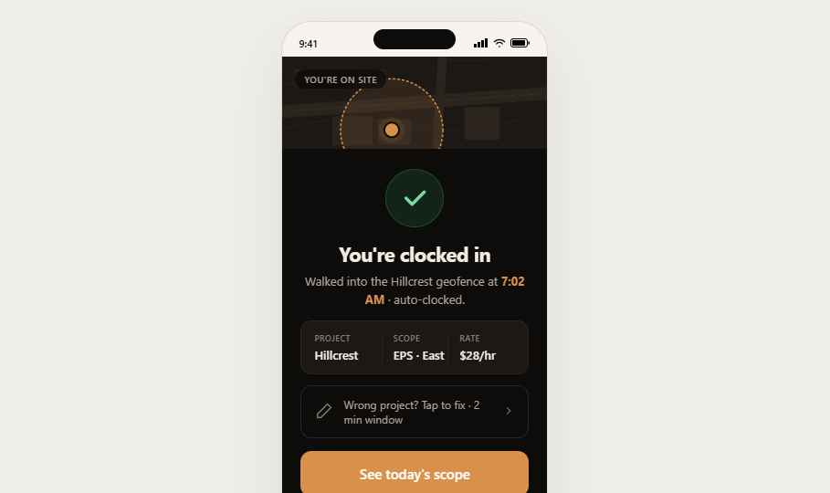
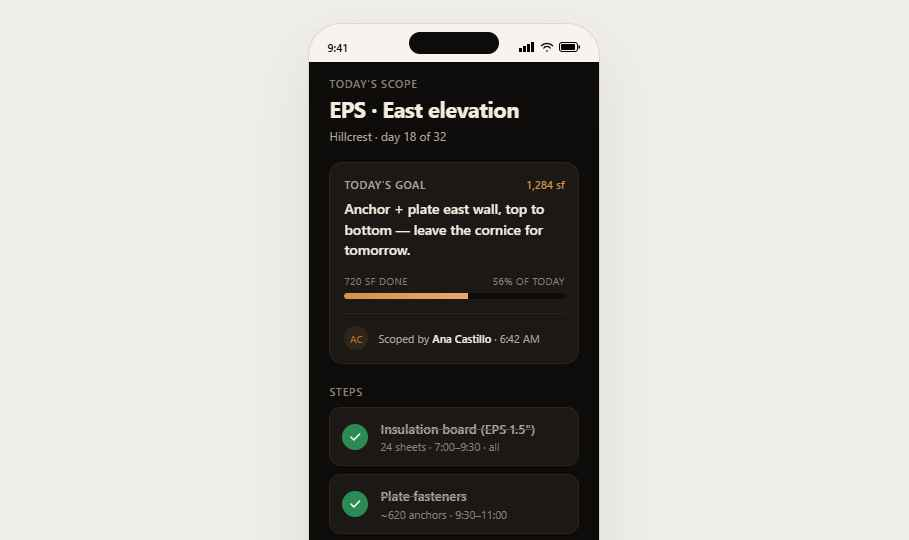
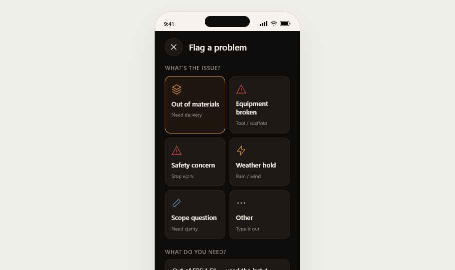
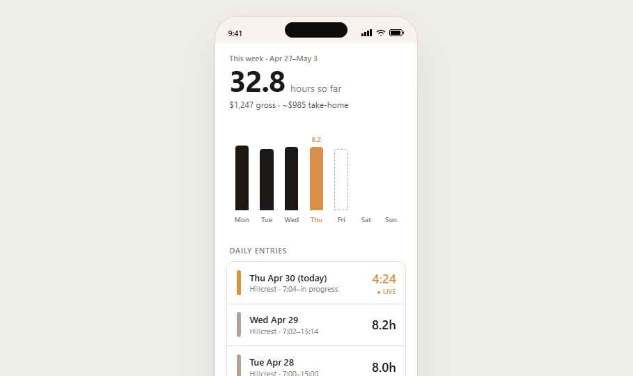
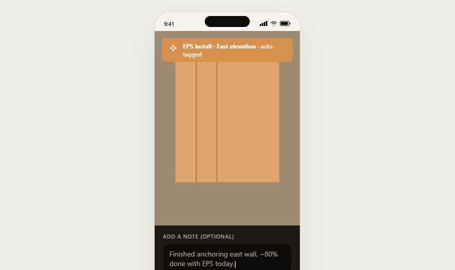

# Worker Persona

## Who they are

The crew member. Trim carpenter, EPS installer, framer, laborer. Hourly. Not in front of a desk — they're on a roof, on a scaffold, in a basement. They use the app:
- First thing in the morning to confirm clock-in
- A few times a day to check what they're doing or log a photo
- When something goes wrong — material short, a question, a hazard
- Friday afternoon to check their hours

They do **not** approve time, send anything to clients, or manage other people. They are recipients of scope (the foreman briefs them) and authors of evidence (photos, notes, issues).

## Form factor

**Mobile only. Phone in pocket, glove on hand.** Dark theme by default — better outdoors, lower battery use, looks distinct from the foreman's lighter UI so a worker can never accidentally confuse "my screen" with "the boss's screen". Tap targets minimum 44px. Big numbers, fewer words.

## Tab structure

Four tabs at the bottom (no "More"):

| Tab | Icon | Purpose |
|---|---|---|
| Today | `home` | Currently-clocked-in clock + today's job + crew on site |
| Scope | `layers` | Today's scope detail — what to build, in what order |
| Hours | `time` | This week's hours; pay-period running total |
| Log | `cam` | Camera-first photo + note logger |

Issue/blocker is **not** a tab — it's a primary action accessible from Today and Scope (the user is already where the issue is contextually).

---

## Flows

### Flow 1 — The full morning (clock-in → scope → first photo)

```
[Worker drives to site]
        │
        ▼
  pwa-loc        ← (one-time) approve "always" location
        │
        ▼
  wk-clockin    ← auto-detected entry inside geofence; "Clocked in at 7:04 AM"
        │  user confirms (or has 60s to override)
        ▼
  wk-today      ← running clock 4:24:18; today's job card; clock out / break
        │  taps "Today's scope"
        ▼
  wk-scope      ← step list (Insulation board ▸ Plate fasteners ▸ Cornice tomorrow)
        │  taps Log a photo
        ▼
  wk-log        ← camera viewfinder, capture, auto-tag (project + scope step)
        │
        ▼
  back to wk-today
```

### Flow 2 — Flag a blocker

```
  wk-today (or wk-scope)
        │  taps "Flag an issue"
        ▼
  wk-issue      ← category picker (Material, Drawing, Safety, Other) + voice/photo + send
        │  immediate optimistic post
        ▼
  back to wk-today  (toast: "Sent to Ana. We'll let you know.")

  ↳ Foreman sees this in fm-field within seconds (see cross_persona/README.md)
```

### Flow 3 — End-of-week check

```
  wk-today  →  Hours tab  →  wk-hours
                                │
                                ▼
                  shows: today, this week (32:18 of 40), labor cost,
                  pay period to date, overtime warning if >40
```

---

## Screens — every one documented

### `wk-today` — Today (clocked-in state)



**Purpose:** The default screen when the worker opens the app during a workday. Shows the running clock, what they're working on, and one-tap break/clock-out.

**Layout (top to bottom):**
1. **Greeting + date** — `Hey, Marcus` (eyebrow `m-ink-3`, 13px) + `Mon · April 28` (display 30px 700) + avatar 36×36 right-aligned
2. **Today's Job card** — dark card (`#18140f`), 12px radius
   - Eyebrow row: `TODAY'S JOB` left, `[AC] scoped by Ana` right (12px, AC avatar amber tint)
   - Title: `Hillcrest Mews — Phase 4` (19px 600)
   - Sub: `EPS · East elevation · 7:00 AM start` (13px ink-3)
   - Section divider eyebrow: `CURRENTLY CLOCKED IN`
   - **Running clock**: `4:24` in 60px tabular weight 600, `:18` seconds in 26px ink-3 — auto-ticks every second
   - Clock meta line: `Started 7:04 AM · break 12:30–1:00`
   - Two action buttons in a row, gap 10px:
     - `Break` — quiet variant, amber dot indicator
     - `Clock out` — primary variant, white dot indicator
3. **Crew on site (3)** section eyebrow + 3 avatar tiles (44×44, role initials)
4. **Today's scope** card (collapsed): `EPS · East elevation` + `2 of 3 steps done` + chevron → tap goes to `wk-scope`
5. **Flag an issue** ghost button — full width, outline, "Flag an issue" + alert icon

**Bottom tabs:** Today active (accent).

**Interactions:**
- `Break` button → confirms via sheet, then collapses card to "On break · 0:04"
- `Clock out` → confirmation sheet shows total hours + meal break compliance check
- Avatar tap → opens "Crew on site" sheet (full roster with status dots)
- Tap on Today's scope card → navigate to `wk-scope`

**Edge cases:**
- Pre-shift (before clock-in succeeds): card shows "Heading to Hillcrest" + ETA + "Cancel" — see Auto-clock-in failure docs
- Off-clock (between shifts): card collapses, shows "Next: Tue 7:00 AM · Hillcrest"
- Approaching overtime: amber pill on running clock at 7:30 elapsed: "Approaching daily OT"

**Copy:** "Clock out" not "Sign off". "Break" not "Lunch" (covers both). No "Welcome back" greetings.

---

### `wk-clockin` — Auto clock-in success



**Purpose:** The single most important worker surface. Confirms that arriving on site automatically created a clock-in entry. This is the value prop.

**Layout:**
1. Top: pull-down arrow icon + `Clocked in` header (28px 600)
2. **Big confirmation chip:** centered, accent-tinted card with green check + `7:04 AM` + `Hillcrest Mews — Phase 4`
3. **Map preview:** static dark map tile with the geofence circle drawn + a pulsing accent dot at the worker's position. ~180px tall.
4. Detail rows (inset list, dark variant):
   - `Job` → `Hillcrest Mews — Phase 4`
   - `Project type` → `EPS · East elevation`
   - `Scoped by` → `Ana Castillo · 6:42 AM`
5. Two buttons:
   - `Open today's scope` — primary
   - `Not me / wrong site` — ghost (the override)

**Interactions:**
- Auto-dismisses after 8 seconds → falls back to `wk-today` with banner "Clocked in 7:04 AM"
- Override → opens correction sheet with project picker + reason ("on a different site", "still driving", "other")

**Critical behavior:** If the device's location services are off, this screen never shows — fall back to `pwa-loc` permission prime first, then manual clock-in via `wk-today`.

---

### `wk-scope` — Today's scope



**Purpose:** What the worker is actually building today. Authored by the foreman in the morning brief (see `foreman/screenshots/fm-brief.png`); read-only here.

**Layout:**
1. Eyebrow `TODAY'S SCOPE` + title `EPS · East elevation` (28px 600)
2. Sub: `Hillcrest · day 18 of 32`
3. **Today's goal card** (dark accent-tinted):
   - `TODAY'S GOAL` eyebrow + `1,284 sf` right-aligned
   - The actual goal copy (3 lines max): `Anchor + plate east wall, top to bottom — leave the cornice for tomorrow.`
   - Progress bar: `720 SF DONE` + `56% OF TODAY` + accent fill
   - Footer: `Scoped by Ana Castillo · 6:42 AM` with avatar
4. **Steps** section eyebrow
5. **Step rows** (dark cards, vertical stack 8px gap):
   - Done step: green check 22px + step title + supporting (`24 sheets · 7:00–9:30 · all`)
   - In-progress step: accent dot + step title + supporting + step time estimate
   - Upcoming: muted ink-3 + step title
6. **Question this scope** ghost button at bottom — opens `wk-issue` with category pre-filled to "Drawing"

**Interactions:**
- Each step card is tappable → expands inline to show notes from the foreman, materials, drawing reference
- "Question this scope" → `wk-issue` with `Drawing` category, scope step pre-attached as context

**Why "Question this" instead of "Flag":** Flagging a *step* of the scope is different from flagging a site-wide blocker. Different language, different context.

---

### `wk-issue` — Flag a problem



**Purpose:** One tap to send a blocker to the foreman. Friction here costs money — every minute a worker stands around with a question is paid time.

**Layout:**
1. TopBar: back chevron + `Flag a problem` + close (right)
2. **Category chips row** (outlined chips, gap 8px):
   - `Material` (selected → accent fill)
   - `Drawing`
   - `Safety`
   - `Other`
3. **What's wrong?** field — large textarea (96px min height), placeholder: `Describe the issue — short is fine.`
4. **Voice option:** mic button row — "Or tap to record · 30 sec max"
5. **Photo attach:** 3-up grid placeholder + camera icon
6. **Severity:** segmented control — `Question` / `Slowing down` / `Stopped`
7. **Send to** picker (read-only): `Ana Castillo · Foreman` + chevron (tap to change recipient)
8. Big primary button: `Send` (full width, accent)

**Interactions:**
- Send → optimistic post, immediately returns to `wk-today` with banner "Sent to Ana. We'll let you know." for 5s
- If offline: banner "Queued — will send when you're back online" (queues to local storage)
- Recipient default = today's foreman; can be changed if multiple foremen on site

**Critical:** This action must succeed even on flaky 4G. Implement with a service-worker queue.

---

### `wk-hours` — My week



**Purpose:** Self-service hours check. No editing — just visibility.

**Layout:**
1. LargeHead: `My hours` + sub `Mar 17 – Mar 23`
2. **Big number:** `32:18` (tabular weight 600 60px) + `OF 40 HRS` eyebrow below
3. **Day strip:** 7 vertical bars (Mon–Sun), height proportional to hours, accent fill, day label below + hours label
4. **Day list** (inset rows):
   - Each row: day + date + project + hours + status dot
   - Tap row → expands inline to show: clock-in time, clock-out, break, project tags, foreman approval status
5. **Pay period summary card:**
   - `Pay period to date` → `$2,184` (loaded labor cost not shown to worker — only their gross)
   - `Approved` `Pending` `Disputed` mini chips with counts
6. Footer: `Questions? Talk to your foreman.` (12px ink-3)

**Interactions:**
- Tap a day → inline expansion (no new screen)
- Disputed entry has a red dot + "Tap to see why" → opens dispute detail sheet

**What's deliberately missing:** Workers cannot edit hours. If a number is wrong, they ask the foreman, who fixes it in `prj-crew-foreman`.

---

### `wk-log` — Photo + note



**Purpose:** The worker's contribution to the daily log. Camera-first.

**Layout:**
1. **Full-bleed camera viewfinder** (dark)
2. Top overlay strip: close ✕ + `Log photo` + flash toggle + flip camera
3. Center-top: small auto-tag chip `Hillcrest · EPS · East elevation` (the system already knows what they're shooting based on geofence + active scope)
4. Bottom controls:
   - **Capture button** — 72px circle, white outer ring, accent inner fill
   - Roll thumbnail (left of capture)
   - Note icon (right of capture)
5. After capture: viewfinder dims; small input slides up: "Add a note — optional" + Send button

**Auto-tags applied:**
- Project (from geofence)
- Scope step (from current active step in `wk-scope`)
- Worker (from auth)
- Timestamp + GPS coords + elevation

**Interactions:**
- Capture → preview sheet → "Add note?" → "Send" attaches it to the foreman's daily log builder (see `foreman/screenshots/fm-log.png`)
- Up to 10 photos per send; each capture chains to the next

---

## State the worker app reads

| Data | Where it comes from | Update cadence |
|---|---|---|
| Today's project | Foreman's morning brief (`fm-brief`) | Pushed when foreman taps Send |
| Today's scope | Same as above | Same |
| Crew on site | Aggregated clock-in events from all workers | Realtime |
| Pay-period hours | Time service | After foreman approves entry |
| Auto clock-in | Geofence enter event + project active flag | Realtime |

## State the worker app writes

| Action | Endpoint shape | Affected personas |
|---|---|---|
| Confirm clock-in | `POST /time-entries` | Foreman sees in `fm-crew`; appears in worker's own `wk-hours` |
| Clock out / break | `PATCH /time-entries/:id` | Same |
| Send issue | `POST /field-events` (kind=blocker) | Foreman receives in `fm-field` |
| Send photo + note | `POST /field-events` (kind=photo \| note) | Foreman ingests in `fm-log` (daily-log builder) |
| Override clock-in | `POST /time-entries/correction` | Goes to foreman's review queue |

---

## Non-goals (do NOT build for the worker)

- Time entry editing
- Project list browsing
- Schedule / week-ahead view (worker sees only today + this week's hours)
- Settings beyond profile photo + notification toggles
- Any approval workflow
- Dashboards
- Reports
- Search

If you find yourself adding any of the above for the worker, stop and ask. The worker app's success metric is **invisibility** — they should think about it as little as possible.
